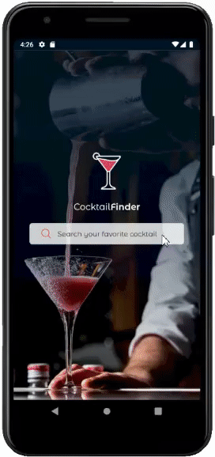

<p align="center">
   
</p>

<p align="center">	
   <a href="https://www.linkedin.com/in/vin%C3%ADcius-fernandes-landim-3a904486/">
      
   </a>
 
  
 
</p>

> An app made to help you choose a Cocktail.

<div align="center">
  <sub>The Cocktail Finder. Built with ❤︎ by
    <a href="https://github.com/viniciusraja">Vinícius Fernandes Landim</a>
   
  </sub>
</div>

# :pushpin: Table of Contents

<!-- * [Demo Website](#eyes-demo-website)    -->

- [Technologies](#computer-technologies)
- [Features](#rocket-features)
- [Libraries](#computer-Used-Libraries)
- [Improvements](#computer-Improvements)
- [How to Run](#construction_worker-how-to-run)
- [Found a bug? Missing a specific feature?](#bug-issues)
- [License](#closed_book-license)

<h2 align="left"> 📥 Layout available for download at: </h2>
<p align="center">
    <a title="Download Figma's Web UI " href="https://www.figma.com/file/Wutw4D7WZ0QGrBO7yaFYqf/Daily-UI-Coquetail?node-id=0%3A1">
        
    </a>
</p>

### App running in Android Simulator

<div align="center" style="display:flex;justify-content:center;align-items:center">
   
</div>

# :computer: Technologies

This project was made using the following technologies:

- [Typescript](https://www.typescriptlang.org/)
- [React Native](https://reactnative.dev/)
- [Redux](https://redux.js.org/)
- [React Navigation](https://reactnavigation.org/)

# :computer: Used Libraries

This project was made using the following Libraries:

- [react-native-linear-gradient](https://github.com/react-native-linear-gradient/react-native-linear-gradient): Used to Create linear gradients, more specifically in the CocktailsCardItem component
- [react-native-fast-image](https://github.com/DylanVann/react-native-fast-image): Used to achieve a better performance in loading multiple images inside CocktailsList(Flatlist) component.
- [react-native-splash-screen](https://github.com/crazycodeboy/react-native-splash-screen): Used to creat Apps Splashscreen.
- [react-native-vector-icons](https://github.com/oblador/react-native-vector-icons): Library of Icons.
- [redux-thunk](https://github.com/reduxjs/redux-thunk): Redux Middleware used to write async logic(fetch cocktails from api) that interacts with the Redux store.

# :computer: Improvements

Improvements that could be implemented in case there was a Large List of items:

- Add pagination to fetch request
- Load cocktails items accordingly to the pagination using FlatList properties such as onEndReached, onEndReachedThreshold to load more items only when getting close to the end of the list.

- Also, could be used some Flatlist properties to increase performance as suggested in the official docs, such as:
  - maxToRenderPerBatch (will limit the number of items rendered per scroll, updateCellsBatchingPeriod (determine the period of reloads per scroll)
  - getItemLayout used to remove the need for FlatList to manage async layout calculations, but can only be used if all the items have the same width or height;
  - windowSize (used to specify the number of viewports loaded, the default value is 21, should choose the best fitting value based on the number of items per viewport).

# :rocket: Features

- Search for different kinds of cocktails.

# :construction_worker: How to run

```bash
# Clone Repository
$ git clone https://github.com/viniciusraja/CocktailFinder.git
```

### 💻 Run React Native Project

```bash

# 1º Install Dependencies
$ yarn install

# 2º Run Metro
$ yarn start

# 3º Step for running in IOS
$ cd ios
$ pod install
$ run the project in Xcode

# 3º Step for running in Android
$ yarn android
```

# :bug: Issues

Feel free to **file a new issue** with a respective title and description on the the [Cocktail Finder](https://github.com/viniciusraja/CocktailFinder/issues) repository. If you already found a solution to your problem, **i would love to review your pull request**!

# :closed_book: License

Released in 2021 :closed_book: License

Made with love by [Vinícius Fernandes Landim](https://github.com/viniciusraja) 🚀.
This project is under the [MIT license](./LICENSE).

Give a ⭐️ if this project helped you!
